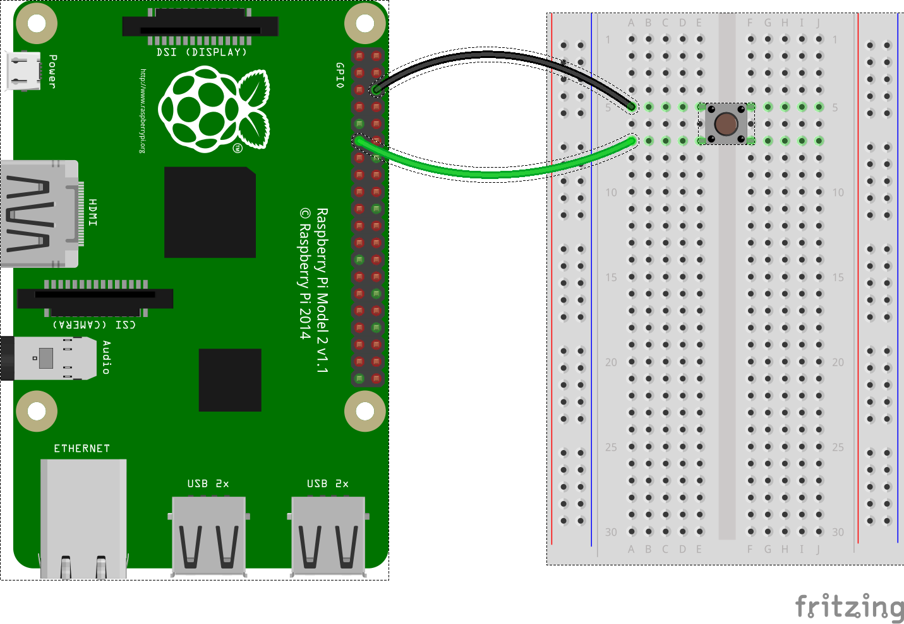

- Στο παρακάτω διάγραμμα, έχει συνδεθεί ένα μονό κουμπί στο pin 17.



- Μπορείς να χρησιμοποιήσεις το κουμπί για να καλέσεις συναρτήσεις χωρίς ορισμούς:

- Πρώτα πρέπει να προετοιμάσεις το κουμπί χρησιμοποιώντας την Python 3 και το module `gpiozero`.

    ```python
    from gpiozero import Button
    btn = Button(17)
    ```

- Στη συνέχεια, πρέπει να δημιουργήσεις μια συνάρτηση χωρίς ορισμούς. Αυτή η απλή συνάρτηση θα εμφανίσει απλώς τη λέξη `Γεια` στο περιβάλλον της python.

    ```python
    def hello():
        print('Γεια')
    ```

- Τέλος, δημιούργησε τον παρακάτω κώδικα με τον οποίο καλείται η συνάρτηση.

   ```python
   btn.when_pressed = hello
   ```

- Τώρα κάθε φορά που πατάς το κουμπί, θα βλέπεις να εμφανίζεται το `Γεια` στο περιβάλλον της Python.

- Η συνάρτησή σου μπορεί να είναι όσο περίπλοκη θέλεις - μπορείς ακόμη και να καλέσεις συναρτήσεις που ανήκουν σε modules. Σε αυτό το παράδειγμα, πατώντας το κουμπί ενεργοποιείται μια λυχνία LED στον ακροδέκτη 4.

    ```python
    from gpiozero import Button, LED

    btn = Button(17)
    led = LED(4)

    btn.when_pressed = led.on
    ```

